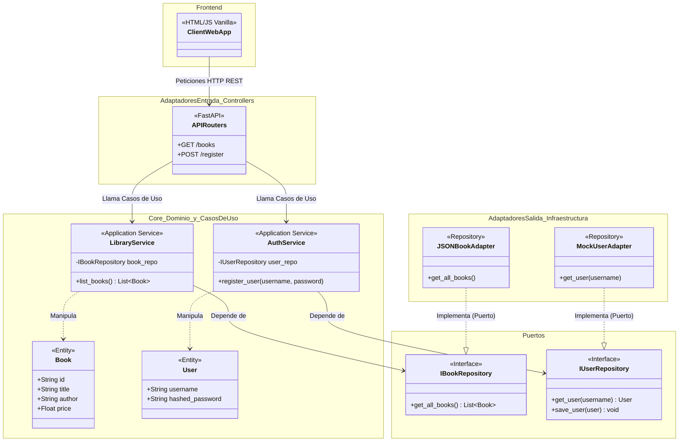

# Documentación Técnica: Proyecto "Lumière"
**Análisis Estructural y Diseño de Software Orientado a Dominio**

---

## 1. Resumen Ejecutivo

El proyecto "Lumière" implementa un diseño de software basado en la **Arquitectura Hexagonal** (también conocida como arquitectura de _Puertos y Adaptadores_). Este paradigma arquitectónico coloca la lógica de negocio (el _Dominio_) en el núcleo absoluto del sistema, aislándola de las tecnologías de infraestructura, bases de datos y capas de presentación.

La principal ventaja de este enfoque es que el núcleo de la aplicación es completamente agnóstico al mundo exterior. Esto significa que nuestra lógica de librería (búsqueda de libros, validación de inventario, registro de usuarios) no conoce la existencia del marco web HTTP (`FastAPI`) ni el medio de persistencia (archivos `JSON` o una base de datos SQL). Toda comunicación hacia y desde el exterior se realiza a través de interfaces bien definidas o "Puertos".

---

## 2. Diagrama de Clases y Arquitectura

Las entidades de dominio en el centro, rodeadas por los servicios de aplicación, y finalmente conectadas a la infraestructura a través de interfaces (Puertos).

_Nota: Las flechas punteadas indican implementación o dependencia débil (Dependency Inversion)._

---

## 3. Justificación de Refactorización

La transición de una arquitectura monolítica (y acoplada) tradicional hacia esta estructura Hexagonal aporta beneficios formidables:

*   **Incremento Crítico en la Testabilidad:** En un monolito, probar una función requería levantar una base de datos real y un servidor HTTP. Gracias a la inyección de dependencias y los "Puertos", podemos inyectar adaptadores Mock durante los tests para verificar la lógica de negocio en milisegundos sin afectar el estado real.
*   **Modularidad Inflexible:** Si se decide migrar el almacenamiento de libros de un JSON a una base de datos PostgreSQL, **no se debe modificar ni una línea de código en los Servicios ni Enrutadores**. Solo se programa un nuevo adaptador.
*   **Retención de Responsabilidad Única (SRP):** El _routing_ (FastAPI) solo serializa peticiones y respuestas, delegando toda la complejidad de negocio a los _Servicios_.

---

## 4. Detalle de Componentes

### 🖥️ Front-end (Capa de Presentación)
Aplicación tipo SPA (Single Page Application) sin frameworks reactivos, usando Vanilla JavaScript, HTML5 y CSS3.
*   **`index.html`:** Estructura de la página y contenedores visuales.
*   **`styles.css`:** Sistema de estilos moderno y _responsive_. Gestión visual general de la librería.
*   **`script.js`:** Lógica en el cliente. Uso de `fetch()` asíncrono para comunicarse con el Backend y manipulación del DOM para renderizar libros y el carrito.

### ⚙️ Back-end (Core & Infraestructura)
Construido sobre Python utilizando `FastAPI` como adaptador web. Organización estricta por roles.
*   **`app/domain/`:** Casos de uso (`LibraryService`) y modelos puros (`Book`, `User`). Sin dependencias a BD ni web.
*   **`app/ports/`:** Interfaces puras que definen los "contratos" para conectarse al mundo externo.
*   **`app/routers/`:** (Adaptadores de Entrada) Controladores REST de FastAPI. Traducen peticiones HTTP a peticiones para el Core de Dominio.
*   **`app/adapters/`:** (Adaptadores de Salida) Implementaciones de los Puertos. Clases concretas que leen los JSONs o interactúan con memoria (`book_repository_mock`).
*   **`container.py`:** Mecanismo de Inyección de Dependencias. Unifica todas las piezas inyectando adaptadores y servicios en donde corresponda.
